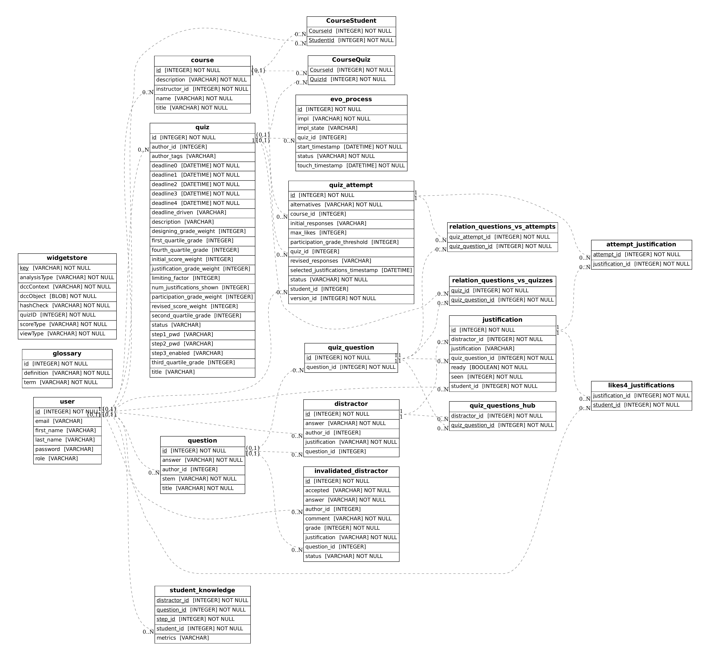

# Reference

This document collects exact factual details about EvoPIE.

## Database schema

The following diagram shows the current EvoPIE database schema.



## Database entities

The schema includes these core tables:

- `user`: students, instructors, and admins.
- `course`: basic course information and course author.
- `CourseQuiz`: many-to-many relationship between courses and quizzes.
- `CourseStudent`: many-to-many relationship between courses and students.
- `quiz`: quiz information and attached configuration.
- `question`: question and answer pool.
- `distractor`: wrong answer choices and final justifications.
- `quiz_question`: question usage inside a quiz.
- `relation_questions_vs_quizzes`: quiz-to-question relationship.
- `quiz_questions_hub`: distractors attached to a quiz question.
- `quiz_attempt`: student answers for Step 1 and Step 2.
- `justification`: student-provided justifications for distractors.
- `attempt_justification`: justifications shown in an attempt.
- `likes4_justifications`: likes on justifications.
- `relation_questions_vs_attempts`: questions attached to an attempt.
- `evo_process`: quiz model state.
- `glossary`: interaction post-processing data.
- `invalidated_distractor`: Step 3 distractors proposed by students.
- `student_knowledge`: student simulation data.
- `widgetstore`: dashboard and interaction post-processing data.

Courses, quizzes, and questions are independent entities connected through
relationship tables. A `quiz_question` represents a question as used in a quiz
and connects that usage to a subset of distractors through
`quiz_questions_hub`.

## SQLite inspection

Use `sqlite3` to inspect a concrete database file. Create a backup before
inspecting a production database.

```bash
sqlite3 DB_quizlib.sqlite
```

Useful SQLite shell commands include:

- `.tables`: list tables.
- `.schema [table]`: show table definitions.
- `.mode line`: show rows with property names.
- `.mode list`: show rows in compact format.
- `.help`: list SQLite shell commands.

## Roles

EvoPIE uses these role names:

- `STUDENT`
- `INSTRUCTOR`
- `ADMIN`

On an empty database, the first account created through the sign-up page
becomes an instructor account. Later accounts become student accounts.

## Quiz and attempt statuses

EvoPIE uses these quiz and quiz-attempt statuses:

- `HIDDEN`: the quiz is not available to students.
- `STEP1`: students answer individually and write justifications.
- `STEP2`: students review peer justifications and revise answers.
- `STEP3`: students may propose new distractors when Step 3 is enabled.
- `SOLUTIONS`: students may view solutions.

## Local commands

Initialize the database tables without dropping existing data:

```bash
pipenv run flask DB-init
```

Drop and recreate the database tables:

```bash
pipenv run flask DB-reboot
```

Populate sample quiz data:

```bash
pipenv run flask DB-populate
```

Run the dashboard updater once:

```bash
pipenv run python updater.py -1
```

Run the dashboard updater every 360 seconds:

```bash
pipenv run python updater.py 360
```

Open a Flask shell with EvoPIE loaded:

```bash
pipenv run flask shell
```

Then import the application objects:

```python
from evopie import *
```

## Environment variables

`FLASK_APP` selects the Flask application entry point. For local commands, use:

```bash
export FLASK_APP=evopie/__init__.py
```

`EVOPIE_DATABASE_URI` selects the database URI. If it is not set, EvoPIE uses a
local SQLite database.

`EVOPIE_UPDATER_SLEEP` controls the updater delay when `updater.py` is run
without a command-line delay argument.

`EVOPIE_DATABASE_LOG` enables SQLAlchemy query logging to the configured file.

`EVOPIE_DEBUG=True` enables the debugpy listener used by the application.

## Important paths

The current Docker Compose deployment uses these paths:

- `/EvoPIE/data`: host data directory.
- `/EvoPIE/data/db.sqlite`: host SQLite database path.
- `/app/data/db.sqlite`: SQLite database path inside the containers.
- `/etc/letsencrypt`: host certificate directory.

The current nginx configuration expects these certificate files:

```text
/etc/letsencrypt/live/evopie.cse.usf.edu/fullchain.pem
/etc/letsencrypt/live/evopie.cse.usf.edu/privkey.pem
```

## Grading components

EvoPIE can compute a total quiz grade from these components:

- Step 1 correctness grade.
- Step 2 revised correctness grade.
- Justification grade.
- Participation grade.
- Step 3 distractor-design grade, when Step 3 is enabled.

The component weights are quiz parameters that instructors can configure.

## Participation grade

For a quiz with $Q$ questions, let $A_q$ be the number of alternatives for
question $q$. The total number of alternatives is:

$$
A = \sum_{q \in Q} A_q
$$

During Step 2, each alternative $a$ is shown with $J_a$ justifications. The
maximum number of likes available to give is:

$$
J = \sum_{a \in A} J_a
$$

The limiting factor $LF$ is an instructor-configured percentage representing
how many likes a student should give to receive full participation credit.

The participation threshold is:

$$
PT = LF \cdot J
$$

A student receives full participation credit when the number of likes they give
falls in this range:

$$
\mathrm{round}(0.8 \cdot PT) \leq \mathrm{likes\_given} \leq PT
$$

## Justification grade

For each student $s$, EvoPIE computes a justification score from likes received
from other students.

For each other student $k$:

- $\mathrm{Likes}(k, s)$ is the number of likes that $k$ gave to $s$.
- $\mathrm{Likes}(k)$ is the total number of likes that $k$ gave in the quiz.
- $PT$ is the participation threshold.

The contribution from $k$ is:

$$
\mathrm{Likes}(k, s) \cdot
\min\left(\frac{PT}{\mathrm{Likes}(k)}, 1\right)
$$

The student's justification score is:

$$
\mathrm{score}(s) =
\sum_{k \in S,\ k \neq s}
\mathrm{Likes}(k, s) \cdot
\min\left(\frac{PT}{\mathrm{Likes}(k)}, 1\right)
$$

EvoPIE then assigns the justification grade by comparing that score to peer
scores and placing it in a configured quartile.

## Justification dispatching

Step 2 shows peer justifications grouped by question and answer choice. The
selection policy chooses a configured number of justification slots from each
group without replacement.

The policy has two goals:

- fairness: give each student a chance for their justifications to be seen;
- quality: show some justifications that are likely to be useful.

The implementation uses policy builders with names such as:

- `j_random`: select a random justification.
- `j_least_seen`: prefer justifications shown fewer times.
- `j_not_seen`: prefer justifications not seen a configured number of times.
- `j_tournament`: select the best candidate from a random tournament.
- `j_slot_group_till`: split slots into groups and apply sub-policies.

The current policy is a slot split. One group uses least-seen selection for
fairness, while another group uses tournament-based selection with author Step
1 performance as a quality signal.

## Quiz models

EvoPIE currently describes these quiz model choices:

- manual selection, which uses the instructor-selected distractor pool;
- random selection, which samples distractors at random;
- Parallel Pareto Hill Climbing, implemented by `PphcQuizModel`;
- sampling strategies based on computed interaction features.

## Certificate operations

The current production deployment uses Let's Encrypt certificates. Certbot
renews certificates on a 90-day cycle.

The server certificate directory contains:

- `live`: symbolic links to currently active certificates;
- `renewal-hooks`: scripts that run before or after renewal.

The renewal hooks have these responsibilities:

- stop services that need ports 80 or 443 before renewal;
- convert certificate files when another service needs another format;
- restart containers that cache certificates after renewal.

## CLI experiment commands

EvoPIE defines Flask CLI commands for simulations and experiments. DECA
experiments use this command shape:

```bash
export EVOPIE_DATABASE_URI=sqlite:///$WORK/evopie/data/db.sqlite
export PYTHONPATH=$(pipenv run which python)
pipenv run flask quiz deca-experiments \
    --deca-spaces $WORK/evopie/data/deca-spaces \
    --algo-folder $WORK/evopie/data/algo \
    --results-folder $WORK/evopie/data/results \
    --random-seed 23 --num-runs 30 \
    --algo "$ALGO_JSON"
```

`ALGO_JSON` contains the selected quiz model class and its parameters, such as
`PphcQuizModel`, population size, Pareto settings, and gene size.

The `slurm` directory contains examples of shell scripts for running CLI
experiments with simulated student groups.

## Debugging

Flask CLI commands can be debugged with VS Code launch configurations that run
the `flask` module with `FLASK_APP=app.py`, `FLASK_ENV=development`, and
command arguments such as:

```text
DB-inspect
quiz init -nq 3 -nd 5
```

## REST routes

EvoPIE is a Flask application, not a complete standalone REST API. Some routes
return or accept JSON and support asynchronous pages, but the project does not
currently expose every operation needed for a separate single-page application.

These route groups are part of the REST foundation:

- `GET /questions`: list questions.
- `POST /questions`: create a question.
- `GET /questions/<id>`: read a question.
- `PUT /questions/<id>`: update a question.
- `DELETE /questions/<id>`: delete a question.
- `GET /questions/<id>/distractors`: list distractors for a question.
- `POST /questions/<id>/distractors`: create a distractor for a question.
- `GET /distractors/<id>`: read a distractor.
- `PUT /distractors/<id>`: update a distractor.
- `DELETE /distractors/<id>`: delete a distractor.
- `GET /quizquestions`: list quiz-question records.
- `POST /quizquestions`: create a quiz-question record.
- `GET /quizquestions/<id>`: read a quiz question.
- `PUT /quizquestions/<id>`: update a quiz question.
- `DELETE /quizquestions/<id>`: delete a quiz question.
- `POST /quizzes`: create a quiz.
- `GET /quizzes/<id>`: read a quiz.
- `PUT /quizzes/<id>`: update a quiz.
- `DELETE /quizzes/<id>`: delete a quiz.
- `GET /quizzes/<id>/take`: get quiz questions for the current step.
- `POST /quizzes/<id>/take`: submit answers for the current step.
- `GET /quizzes/<id>/responses`: read student responses for a quiz.
- `GET /quizzes/<id>/status`: read a quiz status.
- `PUT /quizzes/<id>/status`: set a quiz status.
